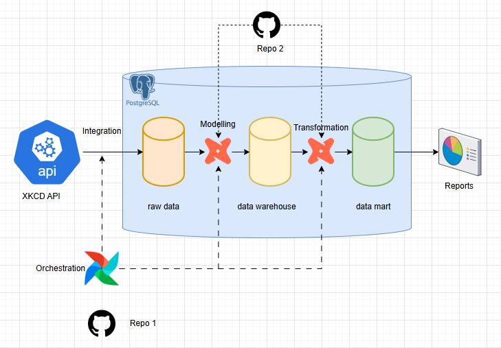

# JET case study

As part of this case study, I designed and implemented a data pipeline that integrates data from the [XKCD Comics API](https://xkcd.com/json.html), models it for analytics, and exposes it after applying business transformations. 
The pipeline leverages Apache **Airflow** for data integration and orchestration, and **dbt** for data modelling, transformation, and testing. And PostgreSQL as the data warehouse. 

This repository holds dbt codes which models and transforms data. 

---
## Technical overview



The data integration from api and orchestration, using Airflow, is maintained in a separate GitHub repository [jet_cs_airflow](https://github.com/nibinmg/jet_cs_airflow.git). During each Airflow DAG run, a dedicated task will synchronizes the dbt repository into the Airflow runtime environment and executes the defined dbt models.

Ingested data is available in **raw** schema. It is then modelled using the Data Vault methodology and stored in the **dwh** schema, which serves as the central data warehouse in this case study.
Finally, data from the warehouse is further transformed using dimensional modelling techniques and made available in the **dm** schema (data mart) for business reporting and analytical use cases.

---
## Prerequisites

Make sure you have the following installed:

- Python

    Either you can have the dbt-core, dbt-postgres mentioned in the requirements.txt installed in local machine or create a venv and set them up. 

- [PostgreSQL](https://www.postgresql.org/download/) 

     I chose PostgreSQL as the data warehouse for this project. To better simulate a real-world deployment, the data warehouse instance is hosted outside the Airflow container, representing an external production database.

     While Airflow also uses PostgreSQL as its metadata database, that instance runs inside the Docker container and is separate from the external data warehouse used for analytical workloads.

- dbt-core

- dbt-postgres

---

## Getting Started with dbt

Follow these steps to set up the dbt for the first time:

1. **Setup DWH(Postgres)**

     In the postgres, create database "jet_db"

2. **Clone the repository**
   ```bash
   git clone <your-repo-url>
   cd <your-repo-folder>
   ```

3. **Place profiles.yml file**

    In the following path create profiles.yml file. 
    
    /user/<username>/.dbt/

    Add the following, with respective postgres credentials

    ```bash
    jet_cs_dbt:
        outputs:
            dev:
            dbname: jet_db
            host: host.docker.internal or <IP>
            pass: <password>
            port: 5432
            schema: dbt
            threads: 1
            type: postgres
            user: <postgres>
        target: dev
    ```

    The profiles.yml file in the repo is for running in Airflow. Do not alter it. 

4. **Check dbt connection**

    ```bash
     dbt debug 
     ```
    

5. **Install the dbt packages**

     ```bash
     dbt deps 
     ```

## Lets run/ test models

    Run all the models
    ```bash
    dbt run 
    ```

    Run all the snapshots
    ```bash
    dbt snapshot
    ```
    
    Run all the tests
    ```bash
    dbt test 
    ```

    Run all the models, snapshots and tests
    ```bash
    dbt build 
    ```

    Generate docs and view them, including lineage
    ```bash
    dbt docs generate
    dbt docs serve --port 8081
    ```